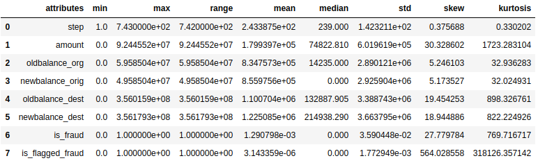
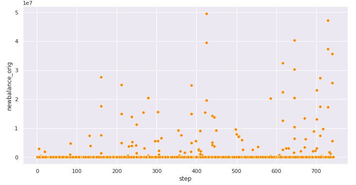

# PA002_blocker_fraud_company

This project contains the solution for this business case (in portuguese): https://bit.ly/34V6Wpw

---

## Table of Contents
- [Introduction](#introduction)
- [1. The Business Challenge](#1-the-business-challenge)
- [2. The Dataset](#2-the-dataset)
- [3. Feature Engineering and Variables Filtering](#3-feature-engineering-and-variables-filtering)
- [4. EDA Summary and Insights](#4-eda-summary-and-insights)
- [5. Data Preparation and Feature Selection](#5-data-preparation-and-feature-selection)
- [6. Machine Learning Modelling and Fine Tuning](#6-machine-learning-modelling-and-fine-tuning)
- [7. Business Performance and Results](#7-business-performance-and-results)
- [8. Next Steps](#8-next-steps)
- [9. Lessons Learned](#9-lessons-learned)
- [10. Conclusion](#10-conclusion)
- [References](#references)

---

## Introduction

This repository contains the solution for this business problem (in portuguese): https://bit.ly/34V6Wpw

This project is part of the "Data Science Community" (Comunidade DS), a study environment to promote, learn, discuss and execute Data Science projects. For more information, please visit (in portuguese): https://sejaumdatascientist.com/

**Project Development Method**

The project was developed based on the CRISP-DS (Cross-Industry Standard Process - Data Science, a.k.a. CRISP-DM) project management method, with the following steps:

- Business Understanding
- Data Collection
- Data Cleaning
- Exploratory Data Analysis (EDA)
- Data Preparation
- Machine Learning Modelling and fine-tuning
- Model and Business performance evaluation / Results

---

## 1. The Business Challenge

**The Blocker Fraud Company**

The Blocker Fraud Company is a specialized company in fraud detection on financial transactions. It has the Blocker Fraud service, which ensures the block of fraudulent transactions. The company's business model is service's performance monetization.

**Expansion Strategy in Brazil**

The company aims to expand its business in Brazil, therefore set the following expansion strategy:

1. The company receives 25% of each transaction value truly detected as fraud.
2. The company receives 5% of each transaction value detected as fraud, however the transaction is legitimate.
3. The company gives back 100% of the value for the customer in each transaction detected as legitimate, however the transaction is actually a fraud.

**Goal of the project**

- Create a model with high accuracy and precision with respect to transactions' fraud detection.

**Deliverables**

- A model that classifies the transactions as "Fraud" or "Legitimate".
- Deployed model with API access. The API must inform "Fraud" or "Legitimate" when the transaction is inputed.
- A Readme about how to use the tool.
- Model performance and results report with respect to profit and loss. The following questions must be answered:

    - What is the model's precision and accuracy?
    - What is the model's reliability with respect to transactions' classification as legitimate or fraudulent?
    - What is the company's forecasted revenue if the model classifies 100% of the transactions?
    - What is the company's forecasted loss in case of model's failure?
    - What is the Blocker Fraud Company forecasted profit using the model?

This repository focuses on the model development and business performance and results.

[back to top](#table-of-contents)

---

## 2. The Dataset
### 2.1. Dataset origin and brief description
The dataset used on this project is a synthetic financial dataset generated in a simulator called PaySim and available on [kaggle](https://www.kaggle.com/ntnu-testimon/paysim1) [[1]](#references). The PaySim simulator uses aggregated data from private dataset to generate a synthetic dataset that resembles the normal operation of transactions and adds malicious behaviour to later evaluate the performance of fraud detection methods.

### 2.2. Dataset Size and Dimensions
The dataset has 6,362,620 entries and 11 features described below:

**step** - maps a unit of time in the real world. In this case 1 step is 1 hour of time. Total steps 744 (30 days simulation).

**type** - CASH-IN, CASH-OUT, DEBIT, PAYMENT and TRANSFER.

**amount** - amount of the transaction in local currency.

**nameOrig** - customer who started the transaction

**oldbalanceOrg** - initial balance before the transaction

**newbalanceOrig** - new balance after the transaction

**nameDest** - customer who is the recipient of the transaction

**oldbalanceDest** - initial balance recipient before the transaction. Note that there is not information for customers that start with M (Merchants).

**newbalanceDest** - new balance recipient after the transaction. Note that there is not information for customers that start with M (Merchants).

**isFraud** - This is the transactions made by the fraudulent agents inside the simulation. In this specific dataset the fraudulent behavior of the agents aims to profit by taking control or customers accounts and try to empty the funds by transferring to another account and then cashing out of the system.

**isFlaggedFraud** - The business model aims to control massive transfers from one account to another and flags illegal attempts. An illegal attempt in this dataset is an attempt to transfer more than 200.000 in a single transaction.

The dataset file has 470 MB, and when loaded in pandas it has a memory usage of 534 MB. 

Therefore, the available RAM memory is crucial to run properly the code. In order not to compromise it, the dataset was several times saved, as the preprocessing was completed, to allow the code execution in steps. Hence, before executing the code it is important to check the available space in HD / memory and how much it will take. The strategy to save the preprocessed dataset and execute the code in steps worked properly in the computer used to develop this project (HD 1TB, RAM memory 8GB), but it may be changed depending on the hardware that it will be executed.

As described in the lessons learned section, the way the dataset is handled is crucial for the model training and hence for the project success. In this case, some attemps were made until reaching the expected performance to meet the project goal.

The dataset was split into train and test set with 70/30 ratio.

### 2.2. Descriptive Statistics
There are 3 data types in the dataset: float64(5), int64(3) and object(3). The dataset does not have NA values, as shown in the image above.

**Summary Statistics:**

**Histogram:**

**Data Description Summary:**

**1. Balances**
- None of the balances have negative numbers.
- The intial balance before the transaction (oldbalance_org) ranges from 0 to aprox. 59 Million. Mean = 834,757. 25% of the observations are equal to zero. 75% of the observations are up to the value of 107,429.
- The new balance after the transaction (newbalance_orig) ranges from 0 to more than 49 Million. Mean = 855,975. 50% of the observations are equal to zero.75% of the observations are up to the value of 144,412.
- The initial balance recipient before the transaction (oldbalance_dest) ranges from 0 to more than 356 Million. Mean = 1,100,704. 25% of the observations are equal to zero. 75% of the observations are up to the value of 943,372.
- The new balance recipient after the transaction (newbalance_dest) ranges from zero to more than 356 Million. Mean = 1,225,085. 25% of the observations are equal to zero - it can be either from merchant or from fraudulent agent behaviour (cashing out of the system). 75% of the observations are up to the value of 1,112,270.

**2. Transaction Amount**
- Transaction amount ranges from 0 to more than 92 Million, Mean = 179,939. The minimum value is equal to zero.
- Between steps 50 and 75 seems that there are few / not transactions;
- After step 400 the frequency of transactions decreases significantly.
- Fraudulent transaction amounts are up to the value of 10 million. There is not fraud transaction above 10 million.
- 11 instances have amount transaction equal to zero, all of them with cash out type and labeled as fraud.
- There are instances with amount higher than oldbalance_org.

**3. fraud label**
- Only 0.13% of the observations are labeled as fraud

**From all fraudulent transactions:**
- 97.91% have newbalance_orig value equal to zero.
- 65.19% have oldbalance_dest value equal to zero.
- 49.9% have newbalance_dest value equal to zero.

**4. is_flagged_fraud label**
- 14 instances are labeled as is_flagged_fraud. That represents only 0.03% of the instances.

**5. Type feature**
- 68% of the transactions are cash out and payment types.
- Almost 22% of transactions are cash in type, 8% are transfer type and only 0.65% are debit type.
- The transfer type has the biggest transaction amount range.

**6. Name_dest, name_orig features**
- Some recipient of transaction participate on transaction more than 80 times.
- Some customers made transactions more than once.

### 2.3. Fraud: intrinsic unbalanced data
One point that stands out is that, as described above, only 0.13% of the observations are labeled as fraud. This is an intrinsic characteristic of fraud detection problems, as the number of legitimate transactions is extremely higher than the fraudulent ones. Therefore, it makes more challenging to detect such fraudulent behaviours among all other legal transactions. More about this will be discussed in section 5.3.

[back to top](#table-of-contents)

---

## 3. Feature Engineering and Variables Filtering
### 3.1. Mind Map and Hypothesis List
The mind map below was created in order to generate a hypothesis list, which will be the guide for the exploratory data analysis (EDA). As a result, this analysis will be the basis for business insights, which can be both new, unknown information obtained from the data analysis, as well as to oppose some biased belief.

**Hypothesis List**

### 3.2. Feature Engineering
- As previously checked in the data description, some amount transactions are higher than the origin banlance before the transaction. Also, there are amount instances equal to zero. Theoretically, the difference between the origin balance before and after the transaction should be equal to the transaction amount. Therefore, a new feature will be created to check this.

- The same is true for the destination balance: theoretically, the difference between the destination balance after and before the transaction should be equal to the transaction amount. Therefore, a new feature will be created to check this.

- As stated above in the features description, the balance destination information for merchant customers is not available. Therefore, a new feature will be created to differentiate such customers to the ordinary ones.

- A new time feature can be created based on the step information to determine the day in which the transactions happened, in order to ease the analysis.

### 3.3. Variables Filtering
The variables filtering step aims to remove the outliers from the dataset.

As previously checked in the descriptive statistics, some features have a huge range of values, particularly the amount, destination balance before the transaction (oldbalance_dest) and the destination balance after the transaction (newbalance_dest), as shown in the boxplot below.

The three boxplots show clearly that the higher the values, the lower the quantity of observations. It is important to note, however, that this is an intrinsic beahviour of banking account, as there is theoretically no limit to transfer or to have a certain amount of money.

Therefore, the line filtering was applied in order to help the model to be trained properly, but also cautiously not to mischaracterize the inherent dataset / problem property.

- Amount: filtered values below 20 million;
- oldbalance_dest: filtered values below 50 million;
- newbalance_dest: filtered values below 50 million.

[back to top](#table-of-contents)

---

## 4. EDA Summary and Insights
### 4.1. Univariate Analysis
As previously analysed in the descriptive statistics, most of the features don't have a good distribution visualization due to theur values range. To better off that, it would be applied for example a log transformation in order to help visualize the distribution, but that was not the focus on this project, can be though an improvement for the next steps.

The new features diff_orig and diff_dest stand out in this analysis, mainly because theoretically, in a normal, regular transaction both should have a value equal to zero. Nevertheless, they have the following behaviour:

- 75% of diff_orig values are negative, which means that transactions amount are higher than the origin balance value.
- This is awkward, since the theoretical diff_orig value should be zero. This must be checked in details in the bivariate analysis.
- The first quartile (25%) diff_dest is equal to zero, which means a correct transaction. However, the merchant destination balance values are equal to zero, therefore this must be checked in details in the bivariate analysis.
- The majority of diff_dest values are higher than zero, which means that the amount transfered is higher than the new balance destination. This must be checked in the bivariate analysis.

The diff_orig scatter plot shows that the fraud points (orange) stands out in the zero line, they represent 14.9% of the diff_orig values.

The diff_dest scatter plot shows that the fraudulent transactions (orange) reach up to 10 million and they stand out from the legitimate transactions, which can be an interesting pattern for the model. Also, 25% of the diff_dest values are equal to zero.

The type feature have the following distribution. Only the CASH_OUT and TRANSFER types have fraudulent transactions.

### 4.2. Bivariate Analysis
Bivariate analysis highlights:

**H1 Fraud should occur with high transaction amount. - TRUE**
- The barplot shows that more than 80% of regular transactions were made with an amount ranging from 0 to 250,000. For fraudulent transactions, this amount range represents only 37% of the transactions.
- Furthermore, 97% of regular transactions were made with an amount up to 750,000. For fraudulent transactions, this range represents 60%.
- Finally, 3,66% of fraudulent transactions were made with an amount from 9,75 million to 10 million.
- Therefore, the hypothesis is true.

**H4 Fraud should occur when origin balance after the transaction is equal to zero. - TRUE**
- 97.91% of fraudulent transactions have origin balance after transaction equal to zero.
- 56.7% of regular transactions have origin balance after transaction equal to zero. That represents 2,518,402 transactions.
- Based on the fraudulent transactions pattern, the hypothesis is true: Fraud occur when origin balance after the transaction is equal to zero.

The scatter plot below shows only the fraudulent transactions.

**H5 Fraud should occur when the origin balance difference before and after the transaction is different from the transaction amount. - FALSE**
- diff_orig = balance before transaction - amount - balance after transaction.
- diff_orig equal to zero means that the difference of origin balance before and after the transaction is equal to the amount of the transaction.
- A negative value of diff_orig means that the transaction amount is not properly taken into account in the origin balance.
- 98.36% of fraudulent transactions have diff_orig value equal to zero.
- Only 14.8% of regular transactions have diff_orig equal to zero.
- In the diff_orig x amount scatterplot it is clear the difference between fraud and not fraud: the fraudulent transactions stay in the diff_orig zero axis for almost every amount value (more precisely 98.36%). On the other hand, the regular transactions have a linear pattern with a 45° slope, which means when both diff_orig and amount have the same value, the transaction is not fraudulent.
- Therefore, the hypothesis is False: Fraud occur when the origin balance difference before and after the transaction is equal to the transaction amount.

**H7 Fraud should occur when the recipient balance difference before and after the transaction is different from the transaction amount. - TRUE**
- diff_dest = oldbalance_dest + amount - newbalance_dest
- diff_dest equal to zero means that the difference between recipient balance before and after the transaction is equal to the amount of the transaction.
- A positive or negative diff_dest value means that the transaction amount was not properly taken into account in the recipient balance. Exception is the merchant customer, which recipient balance is not informed (balance equal to zero).
- 35.39% of fraudulent transactions have diff_dest value equal to zero.
- The diff_dest x amount scatterplot of fraudulent transactions shows clearly that the diff_dest values greater than zero are the same values of amount: it has a line pattern with 45° slope. This line stands out in the diff_dest x amount scatterplot with both regular and fraudulent transactions.
- It is possible to affirm that the transaction is fraudulent when diff_dest is equal to zero or when it is greater than zero and equal to the amount value of transaction.
- A diff_dest value equal to the transaction amount means that the recipient balance before the transaction has the same value of the recipient transaction after the transaction.
- Therefore, the hypothesis is True: Fraud occur when the recipient balance difference before and after the transaction is different from the transaction amount.

**H8 Fraud should not occur when the recipient balance difference before and after the transaction is equal to the origin difference before and after the transaction. - TRUE**
- The diff_dest x diff_orig scatterplot shows that fraudulent transactions happen when diff_orig is equal to zero and diff_dest is greater than zero.
- Theoretically, a transaction without error is when diff_dest and diff_orig are equal to zero, i.e., the transaction amount is correctly considered in the origin and recipient balances.
- When both diff_dest and diff_orig are equal to zero, only 2.37% of the transactions are fraudulent.
- Therefore, the hypothesis is True: Fraud does not occur when the recipient balance difference before and after the transaction is equal to the origin difference before and after the transaction.

**H11 Fraud should occur for transactions made before day 15. - FALSE**
- 2776 fraudulent transactions were made from day 1 until day 15.
- 2971 fraudulent transactions were made from day 16 until day 31.
- 29.8% transactions made on day 3 were fraudulent. Other days with highest fraudulent transaction ratio are day 5 (2.29%), day 27 (3.33%), day 30 (2.41%) and day 19 (2.23%).
- Day 31 stands out from the other days: 100% of the transactions made on this day were fraudulent.
- Therefore, the hypothesis is false: Fraud occur for transactions made after day 15.

**Hypothesis Summary**

### 4.3. Multivariate Analysis
Multivariate analysis of numerical attribues made with pearson's correlation method.

Highest correlations:
- step x day = 1 (day was created with step);
- oldbalance_org x newbalance_orig = 1;
- oldbalance_dest x newbalance_dest = 0.97;
- amount x diff_orig = -0.95;
- amount x newbalance_dest = 0.41;
- newbalance_dest x diff_orig = -0.41;
- oldbalance_dest x diff_orig = -0.25;

The diff_orig feature has more correlation with oldbalance_dest (-0.25) and newbalance_dest (-0.41) than with origin balances. The same is true for diff_dest: it has more correlation with oldbalance_org (0.19) and newbalance_orig (0.19) than with destination balances.

[back to top](#table-of-contents)

---

## 5. Data Preparation and Feature Selection
### 5.1. Rescaling
- The MinMaxScaler was applied to scale the step feature, as it has a low range.

- The RobustScaler was applied to scale the features with a high range of values because it is robust with respect to outliers. The features are: amount, oldbalance_org, newbalane_orig, diff_orig, oldbalance_dest, newbalance_dest, diff_dest.

### 5.2. Transformations
A one hot encoding transformation was applied in the type feature, as it is a categorical feature and has low cardinality.

The nature transformation was applied to the day feature, as it is a cyclic feature.

### 5.3. Why Data Balance was not applied?
A data balance technique was not applied because the fraud problem itself is intrinsically imbalanced. If data balance was applied, it is very likely that the inherent problem nature would be mischaracterized, which could lead to a poor model performance on new data, as the model would be trained on distorced data.

The solution developed in this project aims to preserve as much as possible the inherent data characteristic, hence the outlier filter was carefully applied (see section 3.3) and data balancing was not applied.

### 5.4. Feature Selection
In the first step of feature selection, the unnecessary features were removed:
- step (because day feature was created on it);
- day (because day_sin and day_cos were created on it);
- name_orig and name_dest (based on data analysis, they will not be considered to train the model).

In the second step, the target variable was detached from the training set, in order to allow the model to be trained (section 6).

Two feature selection tools were applied to select the most relevant features:

1. Random Forest as Feature Selector
A Random Forest Classifier was trained and then the feature importance obtained. The plot below shows the feature importance according to the Random Forest classification:

2. Boruta as Feature Selector
The tool Boruta was applied as feature selector in the first version of the project (i.e., with a sampled dataset).
The features selected by Boruta are among the top 7 features selected by the random forest:

Finally, wiht the above-mentioned results and based on the EDA analsysis, the features selected by the Random Forest Classifier were chosen to train the model.

[back to top](#table-of-contents)

---

## 6. Machine Learning Modelling and Fine Tuning
### 6.1. Models and Performance Metrics
The following models were trained to solve the fraud detection task:

- Logistic Regression;
- Random Forest Classifier;
- Isolation Forest;
- XGBoost Classifier.

All the models were evaluated with cross-validation through sklearn's `cross_validate` using 10-fold cross validation.

More information about sklearn's metrics and model evaluation on this [link](https://scikit-learn.org/stable/modules/model_evaluation.html).

The following metrics were used to evaluate the models' performance:

- **Accuracy**

The accuracy represents the ratio between the correctly predicted instances and all the instances in the dataset:

Even though accuracy (ratio of correct predictions) was one of the metrics used to evaluate the models, it is actually not the proper metric for problems with a skewed dataset, specially for high-skewed data such fraud transactions. This is so because more than 99% of the instances have target equal zero (legitimate transaction). Hence, even if the model make all precitions as "zeros", the accuracy will be 99%, but the model actually does not detect the fraud itself, which can lead to a false impression that the model works and lead also to wrong decisions.

- **Precision**

The precision refers to the positive predicted instances: the ratio between the instances correctly predicted as positive (true positive) and all predicted instances (true positive + false positive). A model with a perfect precision should have zero false positives.

- **Recall**

The recall is also called sensitivity or true positive rate and it measures the ratio that the model detects true positives with respect to the actual positives (true positive + false negative). A model with a perfect recall should have zero false negatives, that is, should correctly detect all fraudulent transactions. Hence, it is the best metric to evaluate a model to be applied to solve fraud detection problems.

- **F1-Score**

The F1-Score is the harmonic mean of precision and recall. Whereas the regular mean treats all values equally, the harmonic mean gives much more weight to low values. As a result, the classifier will only get a high F1 Score if both recall and precision are high [[2]](#references).

- **ROC-AUC**

The ROC-AUC is the area under the curve (AUC) of the receiver operating characteristic (ROC) and it is another way to compare classifiers. The ROC curve plots the true positive rate against the false positive rate. A perfect classifier will have a ROC AUC equal to 1, whereas a purely random classifier will have a ROC AUC equal to 0.5. In this project, the ROC-AUC was computed with sklearn's `roc_auc_score()` function.

- **Matthews Correlation Coefficient (MCC)**

The Matthews Correlation Coefficient (MCC) is a measure to evaluate the quality of a two class / binary classifier, and ranges from -1 (inverse prediction) to +1 (perfect prediction), whereas 0 indicates a random prediction. It takes into account the four confusion matrix categories (TP, TN, FP and FN), proportionally both to the size of positive elements and the size of negative elements in the dataset [[3]](#references). The MCC is calculated according to the formula below:

- **Confusion Matrix**

The confusion matrix is a 2x2 matrix that shows the predicted values of the estimator with respect to the actual values. Each element of the matrix is a category as described below:

- True Positive (TP): actual positives that are correctly predicted as positive;
- False Positive (FP): actual negatives that are wrongly predicted as positive;
- True Negative (TN): actual negatives that are correctly predicted as negative;
- False Negative (FN): actual positives that are wrongly predicted as negative.

Sklearn's `confusion_matrix()` function uses the following convention for axes:

The models' predictions were execute with sklearn's `cross_val_predict()` function, which performs predictions through cross validation on the training set. In this case, a 10-fold cross validation. The confusion matrix below were generated with these predictions.

**Logistic Regression**

**Random Forest Classifier**

**Isolation Forest**

**XGBoost Classifier**

The table below shows the performance metrics of each model:

The random forest has the best F1-Score and MCC, therefore it is the chosen model to be applied for the business solution.

### 6.2. Fine Tuning
The hyperparameter fine-tuning is performed in order to improve the model performance in comparison to the model with default hyperparameters.

There are two ways to perform hyperparameter fine-tuning: through grid search or through random search.
In grid search all predefined hyperparameters are combined and evaluated through cross-validation. It is the best way to find the best hyperparameters combinations, however it takes a long time to be completed.
In random search, the predefined hyperparameters are randomly combined and then evaluated through cross-validation. It may not find the best optimal combination, however it is much faster than the grid search and it is largely applied.

In this project, the sklearn's `RandomizedSearchCV` was initially applied, however it did not work as expected and therefore was not able to complete the task. Hence, the code lines were removed in order to keep the functional script in the notebook. This problem is probably due to: 1. the size of the dataset and 2. The computer memory.

As the random search executes a cross-validation for each iterations (i.e., for each random hyperparameter combination), the execution and values are stored in the RAM memory, which due to the size of the dataset cannot afford all these steps. Hence, in order to experiment other hyperparameter combinations rather than the default one, three combinations were randomly set and evaluated on the test set, as shown below.

The models' were compared on the confusion matrix generated with predictions made on the test set:

**Base Model Confusion Matrix (test set)**

**Tuned Random Forest 1 Confusion Matrix (test set)**

**Tuned Random Forest 2 Confusion Matrix (test set)**

**Tuned Random Forest 3 Confusion Matrix (test set)**

Although the "tuned model 1" showed an improvement in the precision and a slightly decrease in the recall, the base model (i.e., the model with default hyperparameters) showed the best result with respect to the business, therefore it is the chosen model to be deployed.

### 6.3. Final Model Performance

As previously mentioned, the Random Forest Classifier with defalut hyperparameters is the chosen model to tackle the fraud detection task. The performance on the test set is displayed below:

[back to top](#table-of-contents)

---

## 7. Business Performance and Results

The business performance and results were calculated based on the business challenge, expansion strategy in Brazil and the CEO's questions, as previously stated on section 1. All the values were computed on the test set with the final model as described in the previous section.

### 7.1. Expansion Strategy Results

The strategy set to expand the business is bold and risky, hence it is paramount that the model works properly in order to achieve the defined goals and avoid losses. A model with bad performance may jeopardize the company expansion, as well as to outcome irreversible losses.

The expansion strategy parameters are listed below with their respective results computed with the model developed in this project.

1. The company receives 25% of each transaction value truly detected as fraud.
- The company will receive 879,444,509.42 due to transactions truly detected as fraud

2. The company receives 5% of each transaction value detected as fraud, however the transaction is legitimate.
- The company will receive 602,524.84 due to transactions detected as fraud, but actually legitimate

3. The company gives back 100% of the value for the customer in each transaction detected as legitimate, however the transaction is actually a fraud.
- The company will give back 2,472,252.25 due to transactions detected as legitimate, but actually fraud

### 7.2. Model's Performance Results on the Business

- The model has a precision of 60.93% and an accuracy of 99.92%. Remark: the accuracy is not recommended for business metric due to the intrinsic skewed data with respect to fraudulent transactions. Instead, it can be used the F1-Score, which is the harmonic mean of precision and True Positive Rate (also known as Recall). The F1-Score of the model is 75.62%.

- **The model can detect 99.63% of fraudulent transactions.** The false positive rate is only 0.08%.

- The forecasted revenue is more than 879 million from transactions truly detected as fraud and more than 600 thousand from transactions detected as fraud, but actually legitimate.

- The forecasted loss is about 2,4 million due to transactions detected as legitimate, but actually fraud.

- **The Blocker Fraud Company forecasted profit is 877,5 million.**

[back to top](#table-of-contents)

---

## 8. Next Steps
The next steps of this project are listed below in priority order:

1. Model deployment;
2. Train another model in order to improve the True Positive Rate (Recall);
3. Model's hyperparameters experiment and evaluation.

[back to top](#table-of-contents)

---

## 9. Lessons Learned
### 9.1. What went wrong?
This is the project's second version with lots of improvements compared to the first one. It took a lot of effort and time to find out the solutions and to reach a project level that works properly and meets the business needs. The details are described below.

The first problem was regarding the size of the dataset. Initially, the project started with 100% of the data. However, early in the descriptive statistics step the kernel crashed. The computer was not able to generate so many graphs and record them in the RAM memory. Therefore, the dataset was sampled. More specifically, a stratified sampling with respect to the target variable was executed. The sampled dataset had 20% of the full dataset and then the project ran without memory problems.

The second problem was regarding the model: the training phase and cross-validation were executed without problems and the results were promissing. However, when the chosen model - a Random Forest Classifier - was applied on the test set, it generated unexpected results, that is, the performance was very different from the training and cross-validation. The model had a poor performance with low results. It could not generalize well on new data. Hence, it overfitted and could not be applied as a solution for the fraud detection task.
The approach to solve the overfitting problem was to increase the training set size: the train and test sets were splitted again, this time with a 70/30 ratio. The model was trained with the new train set and it worked properly in the test set. Nevertheless, the new split generated new problems described below.

The train set with 70% of full dataset led to the first problem previously described: the kernel crashed as the graphs were generated again in this dataset. The solution was to salve the dataset in each step that somehow changed the data (e.g., rename columns or feature engineering), restart the kernel and then run the code again, this time using the previously saved dataset. The jupyer notebook saves the already generated graphs, therefore it is not necessary to re-run it again. This solution worked, however it consumed the HDD space to salve the datasets from each step.

Another problem regarding the size of the training set was to train the K-Nearest Neighbor model. After 09 hours running, it was not yet completed, hence it was aborted and then removed from the project, as the priority was to solve the problem as soon as possible.

Furthermore, in the hyperparameter fine tuning step, the `RandomizedSearchCV` did not work: every time it started executing, the kernel crashed (see section 6.2). In the first version of the project, the hyperparameter random search worked properly and without problems. Hence, as the dataset size increased, and the random search makes 'n' different parameters combination with k-fold cross validation, the kernel / RAM memory could not afford so many data and crashed.
The alternative to solve this problem was to set randomly three random forest classifiers, each with a specific set of hyperparameters, fit them and then evaluate on the test set in order to compare to the base model.
Although the hyperparameter random search did not work, it took a lot of time to study the models' hyperparameters and to find out how the parameters could be set in order to improve the models's performance. 

In addition, another issue came accross: the time x performance trade-off. The hyperparameter fine tuning relies more on experiment than theory, hence only experimenting many different combinations will outcome an optimal model. If one increases both the 'n_iter' (number of combinations random search will try) or the cross validation folds, it will better evaluate the model, however will also increase the execution time. Also, there are other ways to choose the hyperparameters, for example plotting the validation curves with different values of a single hyperparameter to show the model peformance for each of them. In this particular case, time was spent trying to make the random search work (unsuccesfully) and then new random models were trained. The final result was not improved, hence the base model was kept (more on hyperparameter fine tuning, time x performance trade-off: [link1](https://towardsdatascience.com/hyperparameter-tuning-the-random-forest-in-python-using-scikit-learn-28d2aa77dd74) [link2](https://towardsdatascience.com/optimizing-hyperparameters-in-random-forest-classification-ec7741f9d3f6)).

Finally, the isolation forest is largely applied to solve fraud detection problems. However, its performance in this project was not so good, with a recall of 76.9% and a precision of only 0.66% (worst precision among all models). The bad performance could be attributed to the initial hyperparameter settings or to the dataset, which contains lots of outliers. Anyway, to find out what really happened more time should be spent investigating it and experimenting, however the time was short and the priority was to solve the above-mentioned problems in order to get a functional project. But this is an issue that has room for improvement and can thus be better explored in the next project cycle.

### 9.2. What went right?
The descriptive statistics was a real challenge, as the dataset is highly skewed and the features have a high range of values, hence difficult to visualize their distribution (in a histrogram, for example). Nevertheless, after several trials the data could be properly plotted, mainly with scatterplots for the features that have monetary values. The join between descriptive statistics and the graphs was fundamental to better understand the data, detect awkward behaviour (e.g., transaction amount greater than the balance before transaction) and detect fraudulent transaction patterns (e.g., fraud occur only for two transaction types). Such analysis was paramount to the next topic that went right: feature engineering.

The feature engineering was another topic that went right, as the model could reach a good level to solve the business challenge. The feature engineering was made based on the insights obtained from the descriptive statistics. The new features were key to the good model performance that in the end reached the business goal.
The new features were better understood in the other topic that also went well: the exploratory data analysis.

The exploratory data analysis (EDA) was also a really good step, as it showed the behaviour of the original features of the dataset and also of the new ones. The EDA generated thoughtfull business insights and showed clearly the fraudulent transaction behaviours underneath the data, which corroborated the new features pattern that helped the model to learn these fraudulent behaviour and hence generate the performance to solve thoe business challenge.

One interest thing about the descriptive statistics and EDA steps is that after updating them with the 70% train set, the changes were very small compared to the previous analysis performed with the sampled train set (20%), that is, the update did not bring new insights or new relevant information about the dataset, hence the first analysis could be kept and was enough to understand the data and obtain insights from it.

### 9.3. What can be learned from this project?
- The Dataset size can compromise the code execution. How much space it will take must be checked, as well as strategies must be set in the beginning of the project in order to deal with big datasets.

- The descriptive statistics and EDA can be performed with a sample of the full dataset.

- Understand the dataset and obtain insights from it are paramount for the project success.

- The models must be trained with as much data as possible.

- The appropriate metric to evaluate the best model must be determined according to the goal of the project / business.

- The time x performance trade-off is crucial to reach the project goals on time.

[back to top](#table-of-contents)

---

## 10. Conclusion
This project was developed in order to meet the Blocker Fraud Company goal of fraudulent transactions detection. The project focuses on the business expansion strategy, as well as on the performance monetization model. The solution was built in a synthetic financial dataset, which is an inherent imbalanced dataset. This characteristic required a deep statistical, exploratory data analysis in order to understand the fraudulent behaviour and hence extract insights and new features to substantiate the model training and fine tuning. Many errors and challenging situations were faced, hence the project was iteratively tweaked until a reasonable performance was achieved to meet the company's objectives.

The project delivers a model that can detect 99.63% of fraudulent transactions and outcomes a forecasted profit of 877,5 million.

Finally, many aspects of the project went unexpectedly wrong. However, these challenging situations were the driven force to better understand the problem, to search and study possible solutions, and to implement the improvements that were key to the project's successful performance.

[back to top](#table-of-contents)

---

## References

[1] E. A. Lopez-Rojas , A. Elmir, and S. Axelsson. "PaySim: A financial mobile money simulator for fraud detection". In: The 28th European Modeling and Simulation Symposium-EMSS, Larnaca, Cyprus. 2016

[2] Géron, A. (2019). Hands-On Machine Learning with Scikit-Learn, Keras & TensorFlow (2nd ed.). O'Reilly.

[3] Chicco, D., Jurman, G. The advantages of the Matthews correlation coefficient (MCC) over F1 score and accuracy in binary classification evaluation. BMC Genomics 21, 6 (2020). https://doi.org/10.1186/s12864-019-6413-7

[back to top](#table-of-contents)

---

